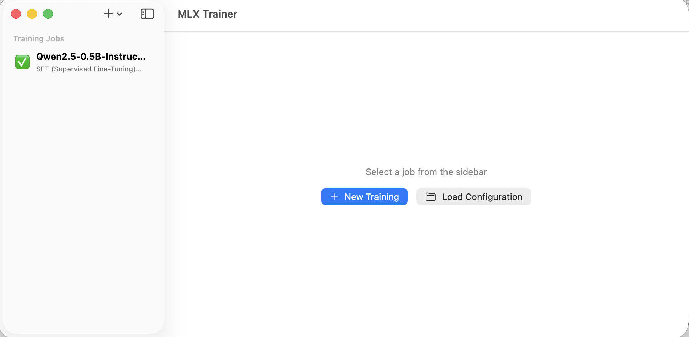

<p align="center">
  <h1 align="center">MLX Training Studio Installer</h1>
  <p align="center"><strong>One-command installer for MLX Training Studio.</strong></p>
  <p align="center">
    A native macOS GUI for fine-tuning LLMs on Apple Silicon, packaged for one-line install.
  </p>
</p>

<p align="center">
  
</p>
<p align="center">
  <sub>
    Screenshot from upstream
    <a href="https://github.com/stevenatkin/mlx-lm-gui">stevenatkin/mlx-lm-gui</a>
    &nbsp;&middot;&nbsp; Apache-2.0
  </sub>
</p>

<p align="center">
  <a href="LICENSE"></a>
  
  
  <a href="https://github.com/jsgermanaai/mlx-training-studio-installer/actions/workflows/ci.yml"></a>
  <a href="https://jsgermanaai.github.io/mlx-training-studio-installer/"></a>
</p>

---

## Quick install

**Homebrew (recommended)**

```sh
brew tap jsgermanaai/tap
brew install jsgermanaai/tap/mlx-training-studio
mlx-training-studio doctor   # verify requirements
mlx-training-studio install  # clone, build, and place the app
```

**One-liner**

```sh
curl -fsSL \
  https://raw.githubusercontent.com/jsgermanaai/mlx-training-studio-installer/main/install.sh \
  | bash
```

**Clone and run**

```sh
git clone https://github.com/jsgermanaai/mlx-training-studio-installer.git
cd mlx-training-studio-installer
./install.sh
```

---

## What this is

This repository is an **installer wrapper**, not the app's source code.

[MLX Training Studio](https://github.com/stevenatkin/mlx-lm-gui) is a native
Swift macOS application by [Steven Atkin](https://github.com/stevenatkin) that
provides a graphical interface for fine-tuning large language models on Apple
Silicon using Apple's [mlx-lm-lora](https://github.com/ml-explore/mlx-examples/tree/main/llms/mlx_lm)
library. The upstream project ships source code only — no pre-built binaries.

This installer clones the upstream source, builds it locally with Xcode, places
the resulting `.app` in `/Applications`, and manages updates and uninstalls.

---

## Why

- The upstream app requires local compilation (no signed binary distribution).
- Setting up Xcode, cloning the right repo, and invoking `xcodebuild` correctly is friction most users don't need.
- This installer removes that friction with a single command and clear error messages for every common failure mode.

---

## Highlights

<table>
  <tr>
    <td width="33%" valign="top">
      <strong>Frictionless install</strong><br>
      One Homebrew formula. One command to build and place the app. Preflight checks run before any work begins.
    </td>
    <td width="33%" valign="top">
      <strong>Hardware-aware preflight</strong><br>
      <code>doctor</code> verifies macOS version, Apple Silicon, full Xcode, Python 3.12+, git, and disk space — with actionable remediation for every failure.
    </td>
    <td width="33%" valign="top">
      <strong>Fully reversible</strong><br>
      Every install writes a manifest. <code>uninstall</code> reads it back and removes exactly what was placed. Re-running <code>install</code> is always safe.
    </td>
  </tr>
</table>

---

## Documentation

Full documentation — including requirements, command reference, architecture, troubleshooting, and FAQ — lives at:

**https://jsgermanaai.github.io/mlx-training-studio-installer/**

---

## Commands at a glance

| Command | Description |
|---|---|
| `mlx-training-studio install` | Preflight checks, clone, build, and install the app |
| `mlx-training-studio update` | Fetch latest upstream, rebuild, and replace the installed app |
| `mlx-training-studio uninstall` | Remove the installed `.app`; prompt to remove source |
| `mlx-training-studio doctor` | Run preflight checks only — no changes made |
| `mlx-training-studio status` | Print the install manifest (commit, paths, timestamp) |
| `mlx-training-studio help` | Show usage information |

---

## Demo

<table>
  <tr>
    <td width="50%" align="center">
      
      <br>
      <sub>New training job wizard</sub>
    </td>
    <td width="50%" align="center">
      
      <br>
      <sub>Live training output</sub>
    </td>
  </tr>
</table>
<p align="center">
  <sub>
    Screenshots from upstream
    <a href="https://github.com/stevenatkin/mlx-lm-gui">stevenatkin/mlx-lm-gui</a>
    &nbsp;&middot;&nbsp; Apache-2.0
  </sub>
</p>

---

## Requirements

| Requirement | Details |
|---|---|
| **macOS** | 13.0 Ventura or later |
| **Architecture** | Apple Silicon (M1 / M2 / M3 / M4) — Intel not supported |
| **Xcode** | Full Xcode 15+ (not just Command Line Tools) — [Mac App Store](https://apps.apple.com/app/xcode/id497799835) |
| **Python** | 3.12 or later — `brew install python@3.12` |
| **Disk space** | ~5 GB free for source + build + first model |

See [full requirements](https://jsgermanaai.github.io/mlx-training-studio-installer/getting-started/requirements/)
in the docs for verification steps and remediation.

---

## Credits

**MLX Training Studio** was created by [Steven Atkin](https://github.com/stevenatkin)
and is published at [stevenatkin/mlx-lm-gui](https://github.com/stevenatkin/mlx-lm-gui)
under the Apache License 2.0.

This installer is an independent, unaffiliated packaging effort. All credit for
the application belongs to Steven Atkin and contributors.

---

## License

This installer is licensed under the Apache License, Version 2.0.
See [LICENSE](LICENSE) and [NOTICE](NOTICE) for details.
