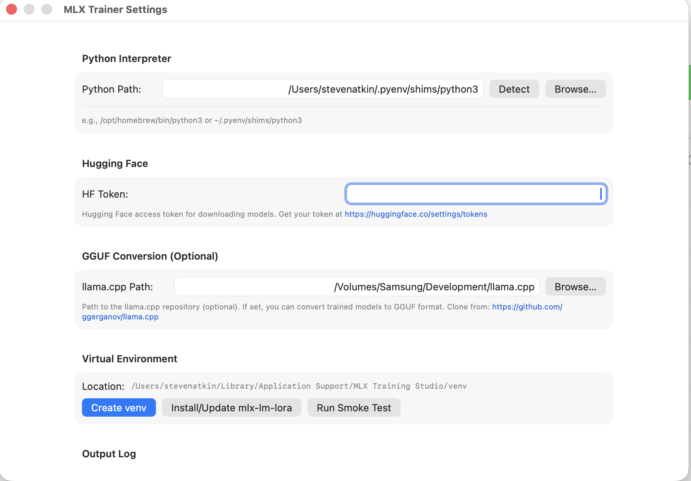

# First Run

After the installer places `MLX GUI.app` in `/Applications`, the first thing to
do is configure the Python environment inside the app. This page walks through
every step.

---

## Gatekeeper warning { #gatekeeper }

Because the app is built locally (not notarized through Apple's servers),
macOS Gatekeeper may block the first launch.

!!! warning "\"MLX GUI.app\" cannot be opened because the developer cannot be verified"
    If you see this dialog, run the following command once to remove the quarantine
    attribute:

    ```sh
    xattr -dr com.apple.quarantine "/Applications/MLX GUI.app"
    ```

    This is safe — you built the app yourself from source. Alternatively, right-click
    the app in Finder, choose **Open**, and click **Open** in the confirmation dialog.

---

## Step 1 — Open the app

```sh
open "/Applications/MLX GUI.app"
```

Or double-click `MLX GUI` in Finder under `/Applications`.

---

## Step 2 — Open Settings

Press ++cmd+comma++ or choose **MLX GUI → Settings** from the menu bar.

The Settings panel looks like this:

<p align="center">
  
</p>
<p align="center">
  <sup>
    Screenshot from upstream
    <a href="https://github.com/stevenatkin/mlx-lm-gui">stevenatkin/mlx-lm-gui</a>
    &nbsp;&middot;&nbsp; Apache-2.0
  </sup>
</p>

---

## Step 3 — Set the Python interpreter path

Paste the path to your Python 3.12+ binary. Common locations:

| Install method | Path |
|---|---|
| Homebrew | `/opt/homebrew/bin/python3.12` |
| pyenv (global) | `~/.pyenv/shims/python3` |
| System (macOS 14+) | `/usr/bin/python3` — **do not use this** |

!!! tip
    Not sure which Python to use? Run `which python3.12` in a terminal. If that
    returns nothing, run `brew install python@3.12` first.

---

## Step 4 — Add your Hugging Face token (recommended)

A Hugging Face token is not required to launch the app, but is required to
download most modern open-weight models (including Llama 3, Mistral, Qwen, etc.).

1. Generate a read-only token at
   [huggingface.co/settings/tokens](https://huggingface.co/settings/tokens).
2. Paste it into the **Hugging Face Token** field in Settings.

!!! note
    The token is stored in the app's preferences on your Mac, not sent anywhere
    else by this installer.

---

## Step 5 — (Optional) Set llama.cpp path

If you want to export fine-tuned adapters to GGUF format, provide the path to
your `llama.cpp` binary (usually `llama-quantize` or the `llama-cli` wrapper).
Leave this blank if you do not plan to export to GGUF.

---

## Step 6 — Create the virtual environment

Click **Create venv** in the Settings panel under the **Virtual Environment**
section. The app will create an isolated Python virtual environment in its
working directory.

!!! info
    The venv is created at a location managed by the app (typically inside
    `~/Library/Application Support/MLX Training Studio/`). The installer itself
    does not create or manage the venv.

---

## Step 7 — Install mlx-lm-lora

Click **Install mlx-lm-lora** (or **Update mlx-lm-lora** if you already have it).
This runs `pip install mlx-lm-lora` inside the venv the app just created.

Expect a download of several hundred MB on the first install, depending on
whether pre-built wheels are available for your Python version.

---

## Step 8 — Run the smoke test

Click **Run Smoke Test**. The Output Log at the bottom of the Settings panel
should show a successful import and version check. If it fails, the most common
causes are:

- Wrong Python path (points to a stub or older version).
- No network access to PyPI during the pip install step.
- Insufficient disk space.

See [Troubleshooting](../help/troubleshooting.md) for detailed remediation steps.

---

## You are ready

Close Settings and return to the main window. You can now click **New Training**
to start your first fine-tuning job. Continue to [Commands](../usage/commands.md)
to learn about the installer CLI, or jump to the
[Upstream App reference](../reference/upstream.md) to learn more about the app's
training modes.
