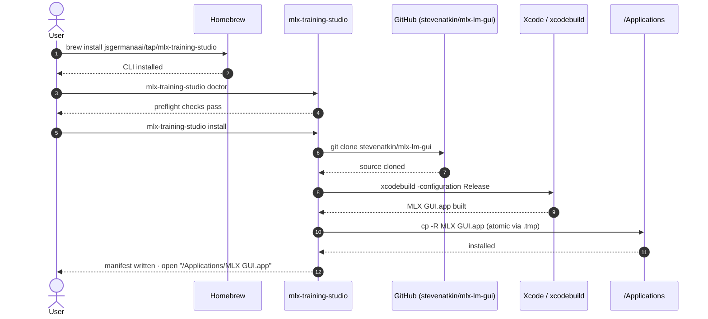

# Getting Started

This section walks you from a bare machine to a running fine-tuning session in
MLX Training Studio. There are four phases:

| Phase | What happens |
|---|---|
| **1. Validate** | Confirm your hardware and software meet the requirements. |
| **2. Install CLI** | Add the `mlx-training-studio` command via Homebrew (or manually). |
| **3. Install app** | The CLI clones upstream source, builds with Xcode, and places the `.app`. |
| **4. Configure & use** | Set up the Python environment inside the app and start training. |
| **5. Stay current** | Use `mlx-training-studio update` whenever you want the latest upstream. |

---

## End-to-end flow

---

## Next steps

-   :material-list-status: **Requirements**

    ---

    Check hardware, macOS, Xcode, and Python before you install anything.

    [Go to Requirements &rarr;](requirements.md)

-   :material-download: **Quick install**

    ---

    Three install methods — Homebrew, one-liner curl, or manual clone.

    [Go to Quick Install &rarr;](quick-install.md)

-   :material-play-circle: **First run**

    ---

    Open the app, configure your Python environment, and run a smoke test.

    [Go to First Run &rarr;](first-run.md)

