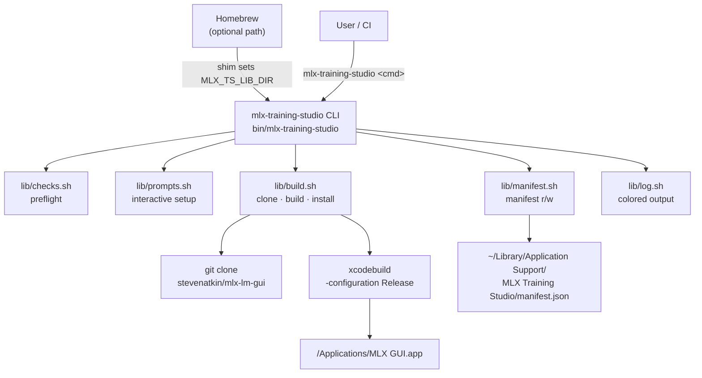

# Architecture

---

## Overview

The installer is a **thin orchestration wrapper** around two heavyweights: the
upstream Swift project and Xcode's build toolchain. The installer itself contains
no build logic beyond invoking standard tools.



The Homebrew formula installs the `bin/mlx-training-studio` script and injects
`MLX_TS_LIB_DIR` via a small shim so the CLI finds `lib/` regardless of where
Homebrew stores its cellar. When installed manually (clone or curl), the CLI
resolves `lib/` relative to its own real location by following symlinks.

---

## lib/ module breakdown

### `lib/log.sh`

Provides colored logging helpers: `info` (blue `[INFO]`), `ok` (green `[ OK ]`),
`warn` (yellow `[WARN]`), `err` (red `[ERR ]`), `die` (err + exit 1).

All output goes to **stderr** so stdout stays clean. Color is auto-disabled when
stderr is not a TTY (e.g., when piped to a file or in CI).

Also provides interactive helpers: `prompt` (reads a line with a default) and
`confirm` (yes/no with a default). Both respect `MLX_TS_NONINTERACTIVE=1` and
non-TTY stdin by silently accepting the default.

**Depends on:** nothing (sourced first by every other module).

---

### `lib/checks.sh`

Six preflight check functions, each returning `0` on pass and `1` on fail:

| Function | Checks |
|---|---|
| `check_macos_version` | `sw_vers -productVersion` ≥ 13 |
| `check_apple_silicon` | `uname -m` == `arm64` |
| `check_full_xcode` | `xcode-select -p` inside `*.app`; `xcodebuild -version` succeeds |
| `check_python` | Finds Python ≥ 3.12; excludes `/usr/bin/python3` stub |
| `check_git` | `git` on PATH |
| `check_disk_space` | ≥ 5 GB free in `$HOME` (warning only) |

`run_all_checks` calls each in sequence, accumulates pass/fail counts, and
returns non-zero if any hard check failed. It is called from both `install` and
`update`.

**Depends on:** `lib/log.sh`.

---

### `lib/prompts.sh`

`gather_install_preferences` sets three exported variables:

- `MLX_TS_SOURCE_DIR` — where to clone upstream source.
- `MLX_TS_INSTALL_DIR` — parent directory for the `.app`.
- `MLX_TS_REF` — optional git ref to pin.

If any variable is already set in the environment, the corresponding prompt is
skipped. In non-interactive mode all prompts are skipped and defaults are used.

**Depends on:** `lib/log.sh`.

---

### `lib/build.sh`

Four public functions, called in sequence by `run_full_install`:

| Function | What it does |
|---|---|
| `clone_or_update_source` | `git clone` or `git fetch && git reset --hard origin/main` |
| `build_app` | `xcodebuild -project "MLX GUI.xcodeproj" -configuration Release -derivedDataPath .build clean build` |
| `install_app` | Atomic `cp -R <built_app> <dest>.tmp && mv <dest>.tmp <dest>` |
| `write_manifest` _(via `lib/manifest.sh`)_ | Writes `manifest.json` |

The `_filter_xcodebuild_output` helper suppresses xcodebuild's verbose log,
printing only `** BUILD SUCCEEDED **`, `** BUILD FAILED **`, `error:` and
`warning:` lines.

**Depends on:** `lib/log.sh`, `lib/manifest.sh`.

---

### `lib/manifest.sh`

Defines `MANIFEST_DIR` and `MANIFEST_PATH` constants and provides:

- `manifest_exists` — returns 0 if the file is present.
- `read_manifest` — prints the JSON to stdout.
- `write_manifest` — writes a JSON blob without requiring `jq`.

The manifest JSON schema is documented in [Files & Paths](paths.md#manifest-schema).

**Depends on:** `lib/log.sh`.

---

## Idempotency

Every command is safe to re-run:

- **install**: if the source already exists, fetches and resets instead of
  cloning. The `.app` is always replaced atomically.
- **update**: same clone-or-fetch logic; always replaces the `.app`.
- **uninstall**: checks for the presence of each item before removing it;
  no errors if already absent.
- **doctor**: read-only by definition.
- **status**: read-only by definition.

---

## Atomic install

The install step uses a `.tmp` intermediate to avoid leaving a half-replaced
bundle if the process is interrupted:

```sh
rm -rf "${dest}.tmp"
cp -R "$built_app" "${dest}.tmp"   # copy first
rm -rf "$dest"                     # then remove old
mv "${dest}.tmp" "$dest"           # then rename — atomic on same filesystem
```

On the same filesystem, `mv` is a directory rename — an atomic kernel operation.
If the copy step is interrupted, the old `.app` is still intact.

---

## Why source-only build

The upstream project ([stevenatkin/mlx-lm-gui](https://github.com/stevenatkin/mlx-lm-gui))
publishes source code only — there are no signed binaries or App Store releases.
The upstream app must spawn Python subprocesses for training, which requires
disabling macOS's app sandbox. Apple does not allow sandboxed apps to be
distributed through the App Store with this capability, and ad-hoc distribution
of non-sandboxed apps requires each user to build locally to satisfy Gatekeeper
without a full notarization identity.

This installer exists precisely to automate that local build step.
