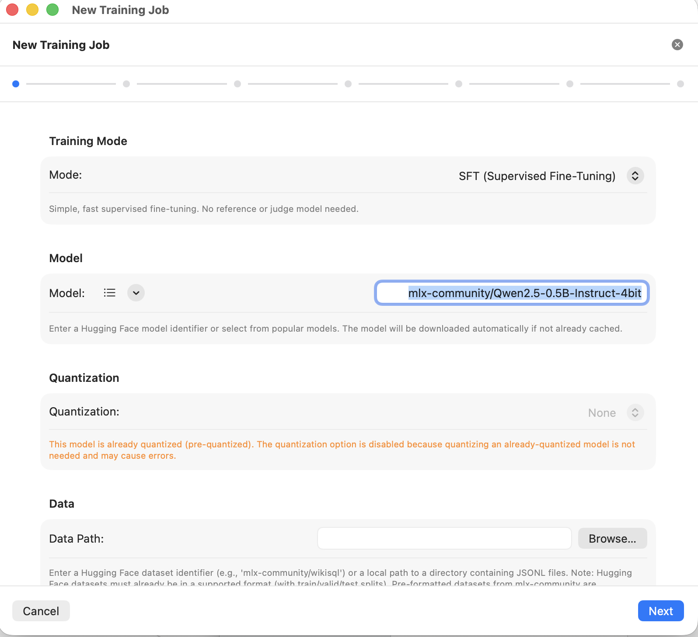
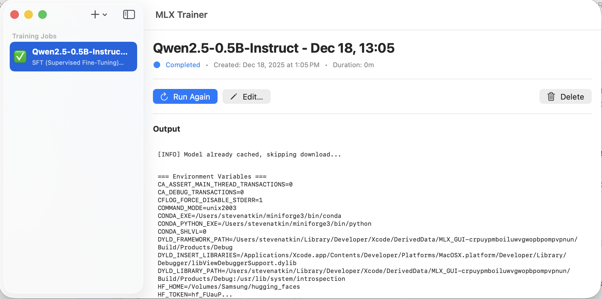

# The Upstream App

This page describes **MLX Training Studio** — the application that this installer
builds and installs. The installer itself is a thin wrapper; the application is
where all the interesting functionality lives.

!!! note
    This page describes the upstream app, not the installer. For installer-specific
    documentation, see [Architecture](architecture.md) and [Commands](../usage/commands.md).

---

## About MLX Training Studio

**MLX Training Studio** is a native macOS application written in Swift by
[Steven Atkin](https://github.com/stevenatkin). It provides a graphical interface
for fine-tuning large language models on Apple Silicon using Apple's
[MLX](https://github.com/ml-explore/mlx) framework and the
[mlx-lm-lora](https://github.com/ml-explore/mlx-examples/tree/main/llms/mlx_lm)
library.

- **Upstream repository:** [stevenatkin/mlx-lm-gui](https://github.com/stevenatkin/mlx-lm-gui)
- **License:** Apache License 2.0
- **Platform:** macOS 13+ on Apple Silicon

---

## Supported training modes

MLX Training Studio exposes mlx-lm-lora's full suite of training objectives
through a point-and-click interface:

| Mode | Full name | Use case |
|---|---|---|
| **SFT** | Supervised Fine-Tuning | Standard instruction-following and task specialization |
| **DPO** | Direct Preference Optimization | Alignment from human preferences (offline) |
| **GRPO** | Group Relative Policy Optimization | Reinforcement learning from verifiable rewards |
| **CPO** | Contrastive Preference Optimization | Preference learning without a reference model |
| **ORPO** | Odds Ratio Preference Optimization | Combined SFT + preference in one pass |
| **Online DPO** | Online DPO | DPO with online data generation |
| **XPO** | Exploratory DPO | DPO with exploratory sampling |
| **PPO** | Proximal Policy Optimization | Classic RL fine-tuning |
| **RLHF** | Reinforcement Learning from Human Feedback | Full RLHF pipeline |

---

## What the app provides

### Training job management

  

  
    Screenshot from upstream
    <a href="https://github.com/stevenatkin/mlx-lm-gui">stevenatkin/mlx-lm-gui</a>
    &nbsp;&middot;&nbsp; Apache-2.0
  

The **New Training Job** wizard lets you select:

- Training mode (SFT, DPO, etc.)
- Model identifier (Hugging Face repo ID, e.g., `Qwen/Qwen2.5-0.5B-Instruct`)
- Quantization settings for QLoRA
- Dataset path and format
- LoRA hyperparameters (rank, alpha, dropout, target modules)

Each job is stored as a YAML configuration file, making runs reproducible and
shareable.

### Live training output

  

  
    Screenshot from upstream
    <a href="https://github.com/stevenatkin/mlx-lm-gui">stevenatkin/mlx-lm-gui</a>
    &nbsp;&middot;&nbsp; Apache-2.0
  

The training output view shows the live console output from the mlx-lm-lora
training process, including loss curves, step counts, and any errors. Completed
jobs can be re-run, edited, or deleted from the sidebar.

---

## GGUF export

If you provide a path to a `llama.cpp` binary in Settings, the app can convert
fine-tuned LoRA adapters to GGUF format for use with llama.cpp-compatible
inference engines (Ollama, LM Studio, etc.).

---

## Why source-only distribution

The app spawns Python subprocesses to run mlx-lm-lora training. macOS's app
sandbox prevents apps from spawning arbitrary subprocesses. Because the upstream
project deliberately does not restrict itself to sandboxed APIs (for good
reason — it needs full control over the Python environment), it cannot be
distributed through the Mac App Store.

Ad-hoc distribution of a non-sandboxed app without Apple Developer notarization
would require each user to lower their Gatekeeper security settings globally.
Building locally from source is cleaner: the resulting binary is associated with
your own machine, Gatekeeper sees it as locally built, and a one-time quarantine
attribute removal is all that is needed.

This installer exists to make that local build process frictionless.

---

## License and attribution

MLX Training Studio is licensed under the
[Apache License, Version 2.0](https://www.apache.org/licenses/LICENSE-2.0).

Full attribution is in [NOTICE](https://github.com/jsgermanaai/mlx-training-studio-installer/blob/main/NOTICE)
at the root of this installer repository.

This installer is an **independent, unaffiliated** project. It is not endorsed
by or affiliated with Steven Atkin or the upstream project. All credit for the
application belongs to Steven Atkin and contributors.
