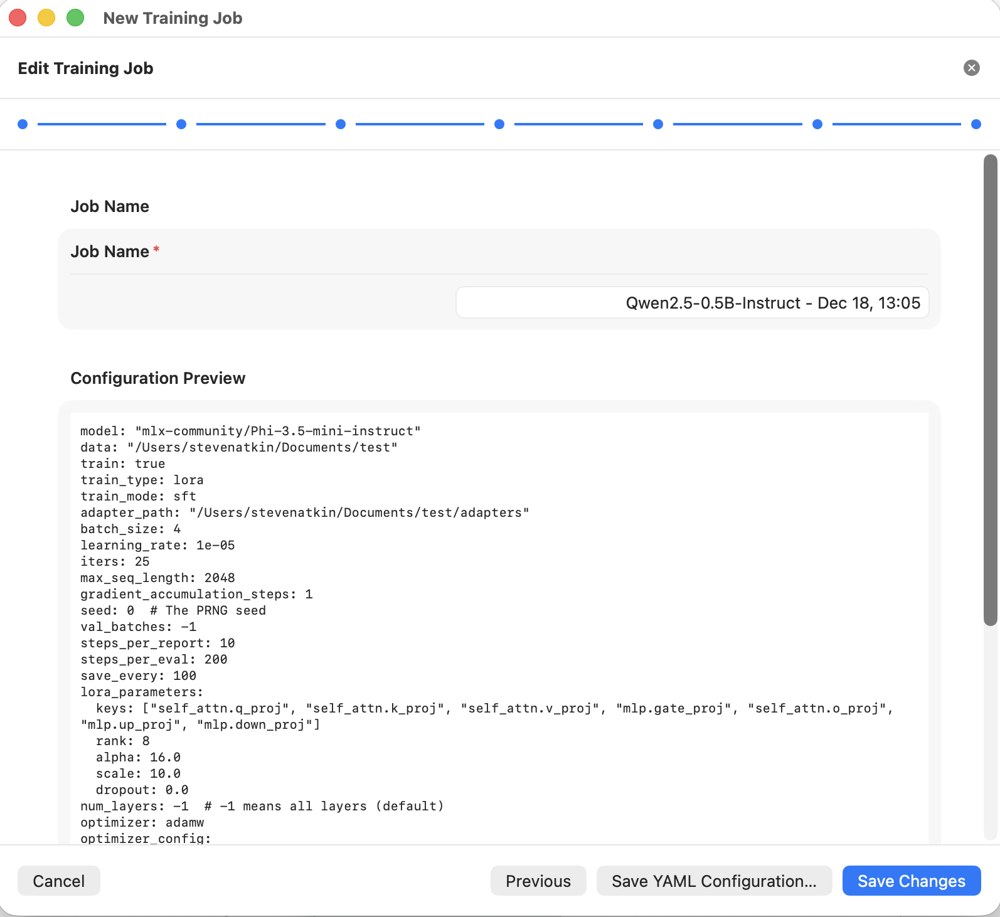

# Configuration

Configuration lives at two distinct layers: the **installer layer** (controlled
by environment variables and interactive prompts) and the **app layer** (the
Settings panel inside MLX Training Studio). The installer does not manage
app-internal settings.

---

## Installer configuration

### Environment variables

All `MLX_TS_*` variables can be set in your shell or exported from a script.
They are read at runtime — the installer never writes a config file of its own.

| Variable | Description | Default | Example |
|---|---|---|---|
| `MLX_TS_NONINTERACTIVE` | Set to `1` to skip all interactive prompts and accept defaults. | _(unset)_ | `MLX_TS_NONINTERACTIVE=1` |
| `MLX_TS_SOURCE_DIR` | Directory where the upstream source is cloned. | `~/Library/Application Support/MLX Training Studio/source` | `MLX_TS_SOURCE_DIR=/opt/mlx-lm-gui` |
| `MLX_TS_INSTALL_DIR` | Parent directory for the installed `.app`. | `/Applications` | `MLX_TS_INSTALL_DIR="${HOME}/Applications"` |
| `MLX_TS_REF` | Git ref (commit SHA, branch, tag) to check out after cloning. Empty string tracks `HEAD`. | _(empty — tracks HEAD)_ | `MLX_TS_REF=a3f9c21` |
| `MLX_TS_LIB_DIR` | Path to the installer's `lib/` directory. Set automatically by the Homebrew shim. | _(auto-resolved relative to `bin/`)_ | _(rarely needed manually)_ |

!!! tip "Unattended / CI installs"
    Combine variables for a fully automated install with no prompts:

    ```sh
    MLX_TS_NONINTERACTIVE=1 \
    MLX_TS_SOURCE_DIR="${HOME}/opt/mlx-lm-gui-source" \
    MLX_TS_INSTALL_DIR="/Applications" \
      mlx-training-studio install
    ```

### Interactive prompts

When running interactively (TTY detected, `MLX_TS_NONINTERACTIVE` not set),
`mlx-training-studio install` asks three questions:

1. **Source directory** — where to clone `stevenatkin/mlx-lm-gui`.
2. **Install location** — `/Applications` (choice 1) or `~/Applications` (choice 2).
3. **Git ref** — leave blank to track HEAD, or enter a commit SHA / tag.

Pressing ++return++ at each prompt accepts the shown default.

---

## App-internal configuration

The app stores all its settings in macOS user preferences (via `UserDefaults`).
You interact with them through the Settings panel — the installer has no
knowledge of or control over them.

### Settings panel fields

| Field | Purpose |
|---|---|
| Python Interpreter | Absolute path to the Python 3.12+ binary the app will use for training. |
| Hugging Face Token | Read token for downloading gated models from the Hub. |
| llama.cpp path | Optional — path to `llama.cpp` for GGUF export. |
| Virtual Environment | Controls for creating the venv, installing mlx-lm-lora, and running the smoke test. |

See [First Run](../getting-started/first-run.md) for a guided walkthrough of the
Settings panel.

### Training job YAML configurations

Each training job in the app is backed by a YAML configuration file. The app's
**Configuration Preview** pane shows the current YAML:

<p align="center">
  
</p>
<p align="center">
  <sup>
    Screenshot from upstream
    <a href="https://github.com/stevenatkin/mlx-lm-gui">stevenatkin/mlx-lm-gui</a>
    &nbsp;&middot;&nbsp; Apache-2.0
  </sup>
</p>

A typical training config YAML looks like:

```yaml
model: Qwen/Qwen2.5-0.5B-Instruct
data: ~/datasets/my-finetune-data
batch_size: 4
lora_parameters:
  rank: 8
  alpha: 16
  dropout: 0.05
  target_modules:
    - q_proj
    - v_proj
num_epochs: 3
learning_rate: 1.0e-4
```

These YAML files are reusable — you can export a config from the app, version it
in your own repository, and re-import it for reproducible training runs. The
installer does not read, write, or modify these files.

!!! note
    The location of stored training configs is managed by the app itself, typically
    inside `~/Library/Application Support/MLX Training Studio/`. The installer
    manifest at that location is a separate file (`manifest.json`) and does not
    interfere with the app's configs.
